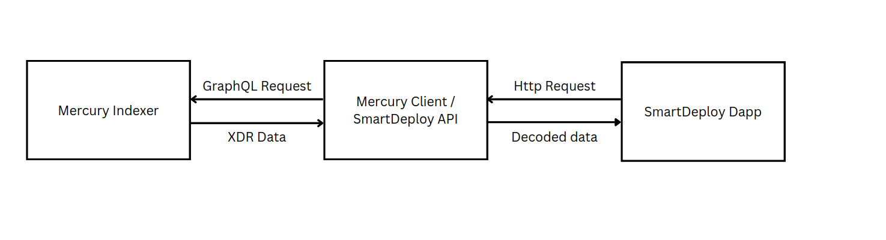

# [Smart Deploy](https://github.com/TENK-DAO/smartdeploy) API / Mercury Client in Rust

This repository contains a [Mercury](https://mercurydata.app/) client developped in Rust with [Shuttle](https://www.shuttle.rs/). It uses the crates [axum](https://docs.rs/axum/latest/axum/), [reqwest](https://docs.rs/reqwest/latest/reqwest/) and [graphql-client](https://github.com/graphql-rust/graphql-client).

More precisely, it requests specific data indexed by Mercury in order to diplay it in the [SmartDeploy Dapp](https://launch.smartdeploy.dev/). Below is the architecture of the whole system:



## What is Mercury?
[Mercury](https://mercurydata.app/) is an indexer service for Stellar and Soroban blockchain. Check more in the [Mercury Docs Page](https://developers.mercurydata.app/).

## Pre-requisites
1. You need a Mercury Token access to use the service. See [Request Access](https://developers.mercurydata.app/requesting-access).
2. You must have already subscribed to contract events or ledger entries. To understand the purpose of subscriptions, check out [that section](https://developers.mercurydata.app/why-subscriptions).<br/>
Struggling to subscribe to contract event or ledger entries? Check out our [Javascript implementation](https://github.com/asanson1404/smartdeploy-indexer).
3. Install **shuttle**:
```bash
$ cargo install cargo-shuttle
```

## Get started
1. Set up your `Secrets.toml` file as following:
```toml
MY_JWT_TOKEN = 'your-mercury-jwt-token'
MERCURY_GRAPHQL_ENDPOINT = 'http://ec2-16-170-242-7.eu-north-1.compute.amazonaws.com:5000'
```
Of course, you will add your Mercury Access Token provided by the team.

2. If you want to query an event by its topic, you have to know the base64-encoded XDR of that topic and paste it in your GraphQL query (see `queries/query_deploy.graphql`).<br/>
As an example, if your event topic is `symbol_short!("deploy")`, you can have its corresponding XDR by running in a node environment:
```javascript
const sorobanClient = require('soroban-client');

const myTopic = sorobanClient.xdr.ScVal.scvSymbol("deploy").toXDR("base64");
console.log(myTopic);
```

3. Define a route to trigger the GraphQL request. In our example, the route is "*/get_deploy*" and the corresponding handler is the function `get_deploy_event` (see `src/main.rs`).

4. Test locally whether everything is working properly:
```bash
$ cargo shuttle run
# or if you want to see the logs
$ RUST_LOG=debug cargo shuttle run
```
Then, start the http request by accessing `http://127.0.0.1:8000/get_deploy`.

5. Deploy your application on Shuttle servers
```bash
$ cargo shuttle deploy
``` 

## Future Work 
1. Decode the XDR data returned by the Indexer and return that decoded data to the Dapp
2. Add a mutation to renew the Mercury API Token?